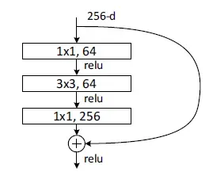
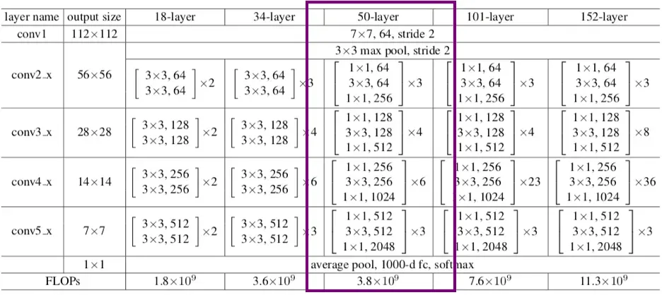
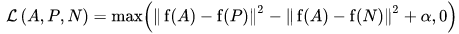
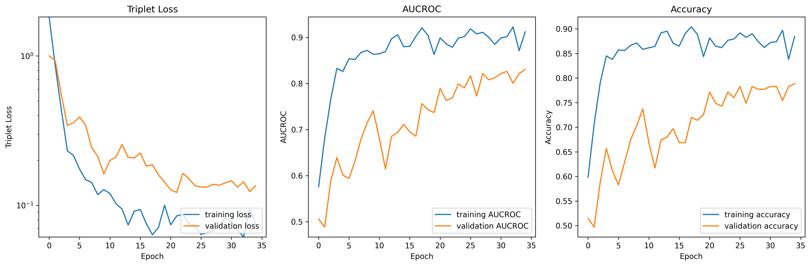
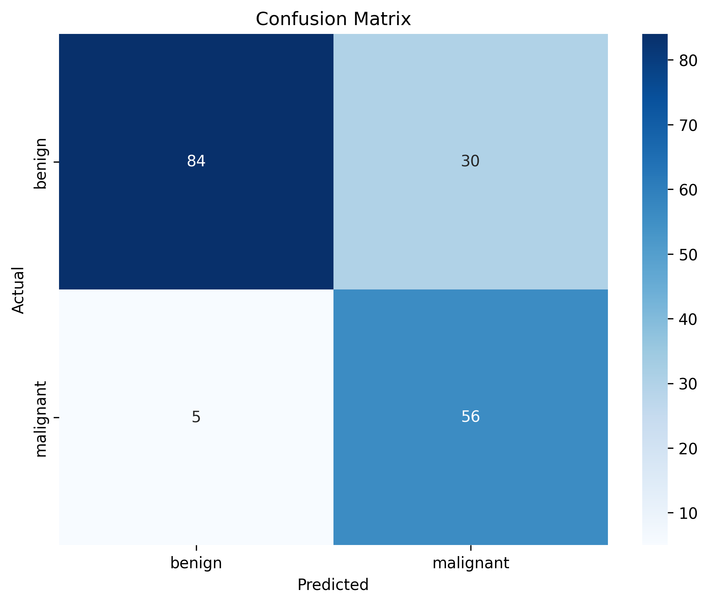
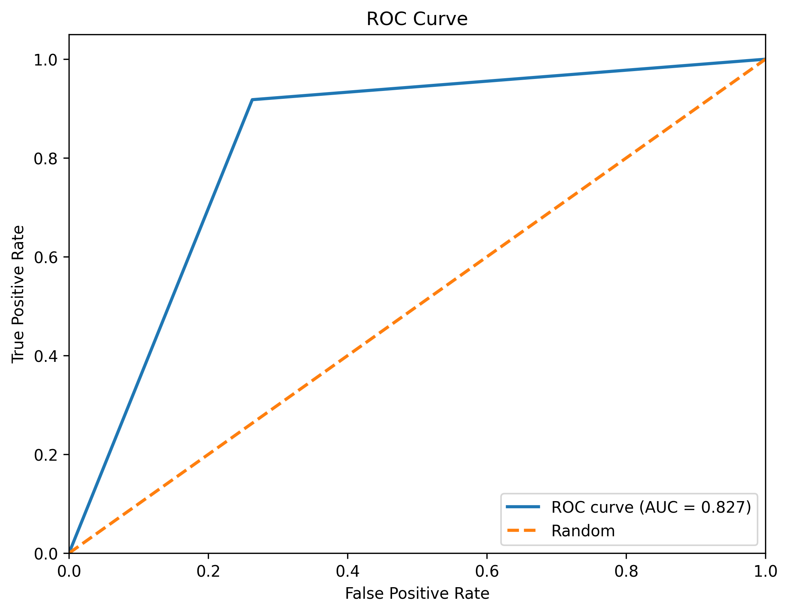

<h1>Siamese Network classification of the ISIC 2020 Kaggle Challenge data set</h1>

<h2> Prerequisites </h2>

Ensure you have [Anaconda](https://www.anaconda.com/docs/getting-started/anaconda/main) installed.

<h2> Notes </h2>

If not otherwise specified it is assumed that the working directory that commands are 
executed in is the `recognition/siamese_kaggle_48020774` directory.

This code was written and tested on Windows Subsystem for Linux (WSL). It has not been
tested on any other system and may not work if you try.

<h2> Model and Training Breakdown </h2>

<h3> Data </h3>

The main concern while using the dataset was the large disparity between the number of 
positive (malignant) and negative (benign) classifications. For the entire dataset, 
only 0.018% of the images have a malignant classification. This large disparity would be 
certain to cause issues during training, as there is a heavy bias towards a model that 
classifies all images as benign. Thus a hyperparameter defining the desired split of 
positive and negative classfications was added and con be configured in 
`utility/config.json`, by changing the value of the `class_split` parameter.

Note that this parameter is the main one used for determining the number of images loaded
into memory. Since there are more negative classifications, a lower percentage will allow
for more of the data to be used for training, while a higher percentage means that less
data can be used in order to maintain the correct ratio.

<h3> hyperparameters </h3>

Below is a list of hyperparameters and their functions

| Name | Function |
| ---- | -------- |
| `data_dir`         | Directory where the dataset is stored relative to working directory|
| `class_split`      | Proportion of positive (malignant) samples in the dataset.   |
| `batch_size`       | Number of samples per training batch.                  |
| `epochs`           | Number of training epochs.                             |
| `learning_rate`    | Learning rate for the optimizer.                       |
| `model_save_path`  | File path to save the trained model.                   |

<h3> Model Background </h3>

The Generic architecture of a Siamese Network features two identical subnetworks 
(twin networks) that share the same weights and parameters. Intended problem that
a Siamese Network solves is to determine whether two input samples are similar or 
different, classic examples being signature and face recognition. In this report
a Siamese Network is used to compare images of skin lesions with known malignant 
and benign melanoma samples, with the goal of classifying the unknown sample.

<h3> Model Architecture </h3>

The architecture used for the twin networks is a ResNet50 Convolutional Neural
Network. Which is proven be effective at extraction of key image features, while
maintaining relative minimality. The ResNet50 architecture features 49 
convolutional layers and a maxpooling layer. It is comprised of multiple blocks
that are that have a "bottleneck" design.

The bottleneck design is conprised of three convolutional layers. The first layer
is a 1x1 convolutional layer that reduces the number of channels, designed to
reduce dimensionality while maintaining key features. The second layer is a 3x3
convolutional layer with a stride of 2, used to extract spatial features. The 
final layer is another 1x1 convolutional layer that returns the dimensionality
to the original number of channels. 



The full ResNet50 architecture employs 4 permutations of the bottleneck block,
arranged as shown below.



A more in depth explanation of the ResNet50 architecture can be found [here](https://blog.roboflow.com/what-is-resnet-50/).

Following the ResNet50 is an encoder head, which is a dense net that reduces the
output of the resnet, over a number of layers to a 256 dimensional vector. This 
vector represents the models encoding of an image into a kind of latent space.
This classifier, the resnet followed by encoder, is what is used as the twin 
network.

In making this a Siamese network, three of the classifiers are run at the same 
time, on an anchor image, known positive image and known negative image. Then,
a "distance" can be calculated between the latent encodings of the images. If
the distance to the positive image is smaller than the distance to the negative
image, the anchor image can be considered classified as positive and vice versa.

To account for this, after the triplet networks, a custom distance layer is added
that outputs the distances to from the anchor encoding to the others. Followed by
a loss layer, that calculates the Triplet loss, explained next, for the optimiser
to use. Finally, a display layer is added, which outputs a 1 if the distance to 
the positive image is greater than (or equal to) the distance to the negative.

<h3> Loss Function </h3>

The loss function used to evaluate the accuracy of the model is triplet loss.
>Triplet loss is a loss function where we compare a baseline (anchor) input to a positive (truthy) input and a negative (falsy) input. The distance from the baseline (anchor) input to the positive (truthy) input is minimized, and the distance from the baseline (anchor) input to the negative (falsy) input is maximized. [[1]](https://builtin.com/machine-learning/siamese-network)


The 'positive' input referred to should have the same classification as the anchor
image, while the negative one should not.

<h3> Training Process </h3>

The model is trained in the regular fashion for a siamese network. Hyperparameters for the training process are configurable in the `config.json` file.

<h2> Using the model </h2>

<h3> Download the dataset </h3>

**Automatic Download**
- Run the data_download script
  
  `./utility/data_download.sh`

**Manual Download**
- Navigate to the [ISIC Kaggle Dataset Page](https://challenge2020.isic-archive.com/)  
- Download the training jpeg zip file
- Download the training metadata
- Run `mkdir data`
- Unzip the downloaded file into the `data` folder
- move the training metadata into the `data` folder
- run `mkdir data/images && mv data/train/* data/images && rmdir data/train`
- The file structure should now be as follows:
  ```
  recognition/siamese_kaggle_48020774
    - data
      - images  (contains the 33,126 training images)
      - ISIC_2020_Training_GroundTruth.csv
    - utility
    .
    .
    .
  ```

<h3> Setting up the conda environment </h3>
Run the conda_setup script:

```    
./utility/conda_setup.sh
```

Activate the environment:

```
conda activate siamese-48020774
```

<h3> Running the model </h3>

To ensure the environment has been set up correctly, it is recommended that the 
`dataset.py` file be run first. This will perform initial data sorting and a test
computation of both a training and testing dataset.

In order to run the model, include the relevant files in your custom script and
follow a similar process to the one shown in `predict.py`. Alternatively, run
`predict.py` for a training process that should provide similar results to those
mentioned in this README. Do enjoy training forever.

<h2> Results </h2>

<h3> Metric Plots </h3>



The above plots show the history of Triplet loss, acurracy and AUCROC score over
15 epochs of training after running `predict.py`. Plots show trends that align with desireable
outcomes, however, validation metrics are notably "unstable". This phenomena is likely due to the 
significant reduction in size of the validation set when compared to the training set,
as it is not unlikely for an epoch of training to not include data that closely
resembles the data used for validating that epoch. In spite of this, average trends
indicate rising classifier ability, demonstrating effective training.

You have likely noted the significant number of training epochs. Due to the heavy handed data
augmentation that takes place in the preprocessing layer, the model was able to train for
this extended period without overfitting, and maintaining a linear trend in accuracy and
AUCROC score.

<h3> Confusion Matrix </h3>



The above matrix shows the distrubution of classifications on a validation set after
training. Since our classifier is designed to detect cancerous samples. The most
important statistic shown is the ratio of true to false positives, as falsely 
identifying a malignant sample as benign could have life altering effect on a patient.
It can be calulated from the figure thatt the percentage of correctly identified positive
samples is 91.22%. This significantly exceeds the desired 80% classification threshold, 
and so, would almost certainly be able to provide helpful insights into real world scenarios.

<h3> ROC Curve </h3>



The above plot shows the ROC curve for the trained model on a validation set, the AUCROC
score being 0.827. This demonstrates that the model well trained for medical use, as one
report states:
>AUC values above 0.80 are generally considered clinically useful [[2]](https://pubmed.ncbi.nlm.nih.gov/38024184/)
Further promoting the real world deployability of this model.